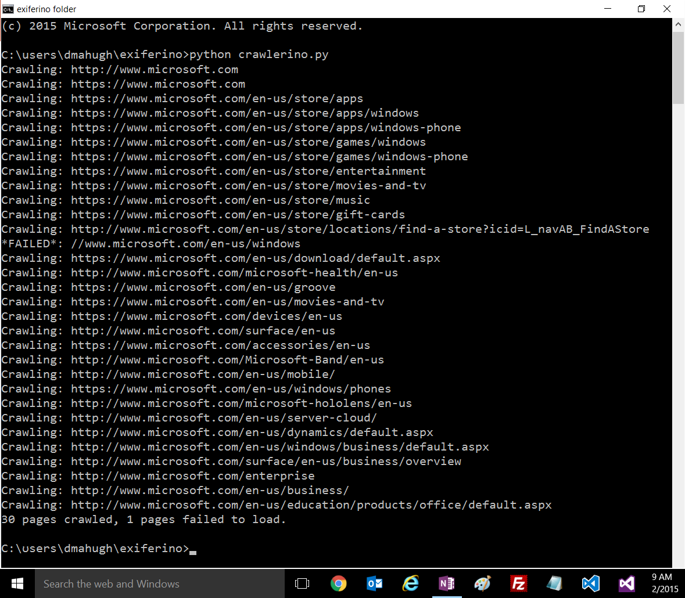

# crawlerino - simple Python 3 web crawler
Crawlerino is a web crawler written in Python 3, and is intended to be used as a starting point for building customized web crawlers to perform various tasks. It uses the _requests_ and _Beautiful Soup_ modules, and the code is optimized for readability and flexibility, not for performance.

The emphasis here is on simplicity, and tothat end here are some things that crawlerino does _not_ handle:

* It doesn't handle authentication, although the use of requests makes this easy to add if needed.
* It doesn't spoof headers. Again, easy to add via requests if desired.
* It ignores robots.txt.

## Installation
Since crawlerino is simply intended as a starting point for customization, it isn't packaged as a Python module. But there are only two dependencies so it's easy to install manually. You need to have Python 3.x installed, and then you just need to install requests and Beautiful Soup:

```
c:\myfolder> pip install requests
c:\myfolder> pip install beautifulsoup4
```
Then you can run crawlerino with the command ```python crawlerino```, and you'll see the output from the test case:


